<p align="center">
  
</p>

<h1 align="center">Taprun</h1>

<h4 align="center">
  Your scraper is broken right now. You just don't know it yet.
</h4>

<p align="center">
  <a href="https://taprun.dev/?utm_source=readme&utm_medium=docs&utm_campaign=homepage"><b>Homepage</b></a> &nbsp;|&nbsp;
  <a href="https://taprun.dev/blog/?utm_source=readme&utm_medium=docs&utm_campaign=blog"><b>Blog</b></a> &nbsp;|&nbsp;
  <a href="https://github.com/LeonTing1010/tap-skills"><b>70+ Skills</b></a> &nbsp;|&nbsp;
  <a href="README.zh-CN.md"><b>中文</b></a>
</p>

<p align="center">
  <a href="https://github.com/LeonTing1010/tap/actions/workflows/ci.yml"></a>
  <a href="https://github.com/LeonTing1010/tap/releases/latest"></a>
  <a href="https://github.com/LeonTing1010/tap/stargazers"></a>
  <a href="LICENSE"></a>
  <a href="https://chromewebstore.google.com/detail/tap/llcidejeoobdegbkolbjhfoeckphldce"></a>
</p>

<p align="center">
  
</p>

---

**Local-first browser automation. Compile once, run forever at zero LLM tokens.**

Point Taprun at any site. Your AI agent inspects the page once and emits a deterministic `.plan.json` program. Replay it forever — same result every call, $0 in tokens. Cookies and login sessions stay in your real Chrome — by architecture, not policy. `tap verify` catches breakage before your data goes stale.

Works with Claude Code, Cursor, Cline, Windsurf, and any MCP host. 70+ pre-built taps, or forge your own from any URL.

```
Capture: AI inspects the site → compiles a .plan.json program     (one-time cost)
Run:     The program executes instantly, same result every time   ($0, zero AI)
Verify:  tap verify checks the snapshot equivalence predicate     (catches drift)
Repair:  re-run capture against the same site/name; the next      (only when needed)
         verify rebaselines after human review
```

## How Taprun Compares

|  | Taprun | AI Browser Agents | Traditional Scrapers |
|--|-----|-------------------|---------------------|
| **AI cost per run** | $0 (compile once) | Tokens every run | Free |
| **Accuracy** | Deterministic | Varies per run | Deterministic |
| **Silent failure detection** | Per-tap CEL `snapshot_equivalent` predicate + 4-arm verdict | None | None |
| **Breakage diagnostics** | `tap verify` — exact diff of what changed | None | Manual spot checks |
| **Detection risk** | Low (real browser sessions) | High | High |
| **Runtimes** | 2 (Chrome extension + Playwright) | 1 | 1 |
| **Code inspectable** | .plan.json — bare JSON, 11-op closed vocabulary, git diff | Black box / ephemeral | Fragile scripts |
| **MCP native** | Yes (authoring layer only — execution is zero tokens) | No | No |

## Get Started

### 1. Install

**Zero-install** via npx (any machine with Node):

```bash
npx -y @taprun/cli --version
```

The first run downloads the matching platform binary (~30MB) and caches it. Subsequent calls are instant.

**Permanent install** via curl (macOS / Linux):

```bash
curl -fsSL https://taprun.dev/install.sh | sh
```

| Platform | Download |
|----------|----------|
| macOS (Apple Silicon) | [tap-macos-arm64](https://github.com/LeonTing1010/tap/releases/latest) |
| macOS (Intel) | [tap-macos-x64](https://github.com/LeonTing1010/tap/releases/latest) |
| Linux | [tap-linux-x64](https://github.com/LeonTing1010/tap/releases/latest) |
| Windows | [tap-windows-x64.exe](https://github.com/LeonTing1010/tap/releases/latest) |

### 2. Connect to Your AI Agent

Works with Claude Code, Cursor, Windsurf, or any MCP-compatible agent — no extension needed:

```json
{ "mcpServers": { "tap": { "command": "npx", "args": ["-y", "@taprun/cli", "mcp", "stdio"] } } }
```

Or run the server directly:

```bash
tap mcp stdio    # default; pipe to your MCP host
tap mcp http     # streamable-HTTP on 127.0.0.1:7891 (bearer auth)
```

### 3. Go

```bash
tap github/trending              # GitHub trending repos
tap hackernews/hot               # Hacker News front page
tap weibo/hot                    # 微博热搜
tap xiaohongshu/search --keyword "AI"  # 小红书搜索
```

Or just ask your AI agent:

```
You:   What's trending on GitHub today?
Agent: Here are today's top repos — React compiler hit 734 stars...

You:   Capture a tap for Douban top 250 movies
Agent: Done. Run `tap douban/top250` anytime — $0 per run.
```

### Optional: Chrome Extension (for login-required sites)

Most taps work without login. For sites that need your session (Xiaohongshu, Zhihu, etc.), install the [Chrome Extension](https://chromewebstore.google.com/detail/tap/llcidejeoobdegbkolbjhfoeckphldce) from the Chrome Web Store.

### Optional: Embed in your agent code (TypeScript / Python)

Skip MCP — call the `tap` binary from your own loop:

```bash
tap hackernews/top --args '{}'    # JSON-on-stdout, exit 0 on success
tap verify hackernews/top         # 4-arm verdict (equivalent / drifted / first_snapshot / unreachable)
tap capture <url> hackernews/top --intent "front-page top stories"
```

The CLI emits `ToolResult<T>` envelopes as JSON — same shape the MCP surface returns — so any language with a subprocess library can drive it. See `tap --help` for the full verb list.

### Have an existing Playwright / Puppeteer / Stagehand script?

Don't rewrite. Convert with one of the open-source adapters — drop your existing source in, get a Tap-compatible `.tap.json` plan out:

```bash
# Existing Playwright script (47M weekly npm downloads — most likely the one you have)
npm install @taprun/from-playwright @taprun/spec
node -e "import('@taprun/from-playwright').then(m => console.log(m.playwrightToTap(require('fs').readFileSync('tests/login.spec.ts','utf8'), {site:'example', name:'login'})))"

# Or scaffold a new starter from scratch
npx create-tap-script github/trending https://github.com/trending
```

| Adapter | Source format | Coverage |
|---|---|---|
| [`@taprun/from-playwright`](https://www.npmjs.com/package/@taprun/from-playwright) | `.ts/.js` Playwright tests | 8 page.* APIs (goto/click/fill/type/press/waitForSelector/waitForTimeout/screenshot) |
| [`@taprun/from-puppeteer`](https://www.npmjs.com/package/@taprun/from-puppeteer) | `.ts/.js` Puppeteer scripts | 7 page.* APIs + page.keyboard.press |
| [`@taprun/from-stagehand`](https://www.npmjs.com/package/@taprun/from-stagehand) | `.ts/.js` Stagehand scripts | Hybrid: deterministic page.* mapped to plan ops; NL `act/extract/observe` flagged for honest verify verdicts |
| [`create-tap-script`](https://www.npmjs.com/package/create-tap-script) | (none — scaffolder) | Generates a starter `.tap.json` envelope from `<site>/<name> <url>` |

The format itself is documented at [`@taprun/spec`](https://www.npmjs.com/package/@taprun/spec) (TypeScript types + W3C Annotation MUST-validator + JSON Schema 2020-12 + 10-fixture conformance suite). Plan-v1 reference: [taprun.dev/spec/plan-v1](https://taprun.dev/spec/plan-v1/). Source for all five packages: [`packages/`](packages/).

## What Can You Do?

**Read** — Extract data from any website

```bash
tap reddit/hot                   # Reddit front page
tap bilibili/trending            # Bilibili trending
tap arxiv/search --keyword "LLM" # arXiv papers
```

**Write** — Operate any website

```bash
tap xiaohongshu/publish --title "My Note" --images photo.jpg
tap zhihu/publish --title "My Article" --content "..."
```

**Watch** — Monitor changes

```bash
tap verify github/trending        # spot drift; schedule via cron / launchd
```

**Compose** — Chain like Unix pipes

```bash
tap github/trending | tap filter --field stars --gt 500 | tap table
```

**Forge** — Create new automations with AI

```bash
tap capture https://news.ycombinator.com hackernews/hot --intent "top stories"   # API detected — compiled without AI
tap capture https://example.com mysite/home --intent "..."                       # BYOK Claude / GPT for the long tail
```

Bring your own model — works with Claude, OpenAI, DeepSeek, or any
OpenAI-compatible endpoint including **local Ollama / LM Studio** for
fully offline forge:

```bash
tap config set ai.baseUrl http://localhost:11434/v1
tap config set ai.key ollama
tap config set ai.model llama3.1
tap capture https://arxiv.org/list/cs.AI/recent arxiv/recent --intent "recent papers"  # 0 bytes leave your machine
```

## How It Works

```
                        ┌─ Chrome extension  (your real browser sessions)
You → AI → Taprun ──────┤
     capture            └─ Playwright        (headless, server, CI/CD)
```

1. **You describe** what you want (URL × natural-language intent)
2. **AI compiles** it into a `.plan.json` program — bare JSON, 11-op closed vocabulary, version-controlled
3. **Taprun runs** the program on either runtime — forever, at $0

Every successful compilation makes the next one faster. 70+ community taps mean your agent already knows the common patterns.

## Community Skills

**[tap-skills](https://github.com/LeonTing1010/tap-skills)** — 70+ taps, open source.

| Category | Examples |
|----------|---------|
| **Trending** | GitHub, Hacker News, Reddit, Product Hunt, Bilibili, Zhihu, Weibo, Xiaohongshu |
| **Search** | arXiv, Reddit, X, Zhihu, Weibo, Xiaohongshu, Bilibili, Medium |
| **Read** | Zhihu threads, Bilibili videos, Xiaohongshu notes, WeRead books |
| **Write** | X posts, Xiaohongshu notes, Zhihu articles, Dev.to, LinkedIn |
| **Monitor** | Price tracking, stock data, competitor analysis |

```bash
tap verify <site>/<name>   # Snapshot equivalence — catches silent failures before your data goes stale
tap list                   # See everything available
tap show <site>/<name>     # Print the saved tap's plan as JSON
```

## Local-first by architecture

Taprun runs in **your** browser, not someone else's cloud. The Chrome extension reuses your live login sessions; cookies, auth tokens, and credentials never leave your machine. This is a structural choice, not a marketing claim:

| Concern | Cloud-first browser SDKs | Taprun (local-first) |
|---|---|---|
| Where do logged-in cookies live? | On the cloud vendor's servers | Only in your local browser |
| What does the AI see? | The full session + your data | Only the page DOM during forge time |
| Compliance with `noindex` / robots.txt / TOS | Vendor signs ToS for you | Your account, your terms |
| Internal / intranet sites | Need VPN tunneling | Just open the page |
| Decommission risk | Vendor goes down → your scrapers stop | Local code keeps running |

| Layer | Protection |
|-------|-----------|
| **Sandbox** | Programs run with zero permissions — no file, network, or system access |
| **Static Analysis** | CI blocks dangerous patterns before they reach users |
| **Local-only** | Your data, sessions, and API keys never leave your machine — architecturally |

See [SECURITY.md](SECURITY.md) for the full threat model.

## Contributing

The easiest way to contribute: **forge a new tap.** One `.tap.js` file is all it takes.

See [CONTRIBUTING.md](CONTRIBUTING.md) for details.

## Roadmap

- [x] 70+ community taps across 68+ sites
- [x] 2 runtimes — Chrome extension + Playwright (headless / CI)
- [x] Unix pipes — `tap A | tap B`
- [x] Watch mode — monitor changes over time
- [x] Doctor — health contracts, fingerprint diffs, automatic diagnostics for broken taps
- [x] Single-command MCP server — `tap mcp stdio` (or `tap mcp http`) for any MCP host
- [ ] Android runtime
- [ ] iOS runtime
- [ ] Concurrency control — deterministic coordination for M agents operating shared accounts in parallel

## Support

- [GitHub Discussions](https://github.com/LeonTing1010/tap/discussions) — Q&A, ideas, show & tell
- [support@taprun.dev](mailto:support@taprun.dev) — licensing, private feedback, consulting
- [Issues](https://github.com/LeonTing1010/tap/issues) — bug reports

## License

Chrome Extension & docs: [MIT](LICENSE). Community skills: [MIT](https://github.com/LeonTing1010/tap-skills/blob/main/LICENSE).

## Star History

[](https://star-history.com/#LeonTing1010/tap&Date)
